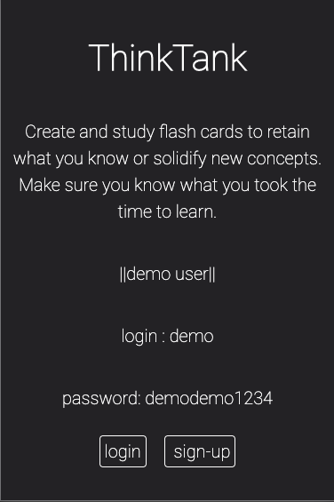
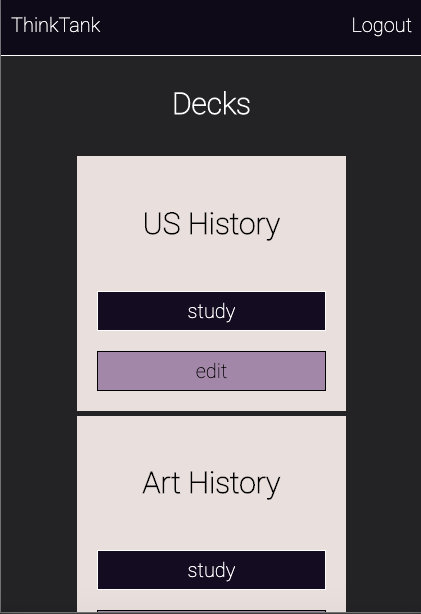
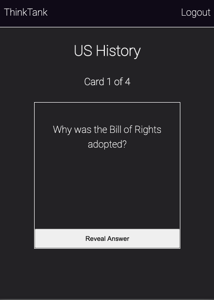
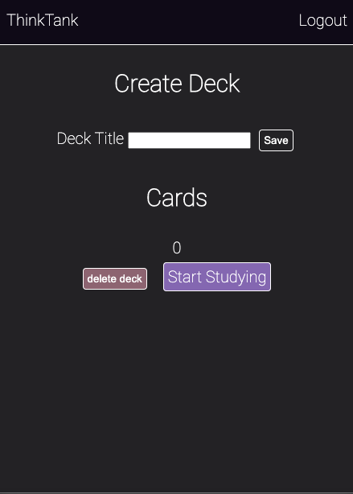

## Think Tank

[live link](https://thinktank-client.vercel.app/)

A full-stack app where users can create and study flashcards. Users can login and register securely. Users cards are saved to their account.

### App photos

### Technology

Front End: HTML5, CSS3, JavaScript ES6, React
Back End: Node.js, Express.js, JWT, Mocha, Chai, RESTful API Endpoints, PostgresSQL
